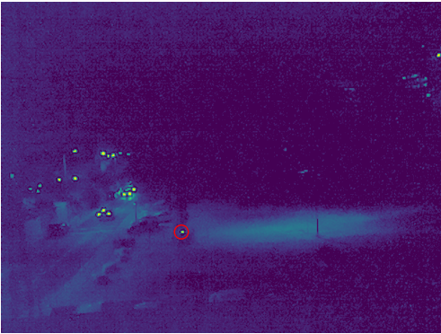

# Nano Satellite Optical Alignment for Laser Based Communication
[-Shai Aharon](https://github.com/ifryed)

## Introduction
In recent years, the user of small satellites (AKA
NanoSat) has been growing rapidly. Satellites, which were
once a big and complicated systems, which required well
established companies or government agencies to design
and manufacture, can be now made by small talent full
labs. Today, a satellite the size of half a shoe box, can
be manufactured using off-the-shelf consumer products and
have a wide range of capabilities such as communications,
self-tracking, imagery and much more.

With all of the Nano-Satellites’ advancements, the communication is still basic. 
Currently, due to their size, they need to use small and energy efficient means for communication.
Most commonly used is LoRa, which stands for Long Range communication. 
LoRa has the advantage of transmitting and receiving using Radio Frequency (RF) signals over 
long distances, such that are suitable for space flight, while maintaining a low-energy consumption 
and a small size. The down side of LoRa is it’s bandwidth, which can usually send up to 50 bytes per 
packet. This limitation is not noticeable for getting status updates or sending short commands to the 
satellite, but transmitting an image over LoRa, even a small as 16K will have to use 320 packets. This 
is not feasible, especially when you consider lost packets and narrow time window where the satellite 
is in transmitting range.

Due too space and energy restrains, we cannot load 
a stronger RF transmitter on the satellite, instead, we
switched the RF for laser based communications for highbandwidth tasks. The idea is to transmit data using a lase

## Code
### Requirements
    numpy>=1.19.5
    opencv_contrib_python>=4.1.2.30
    picamera>=1.13

To run the code, load it on a RaspberryPi and type

    python main.py -f [The lasers blinking frequency (FPS), default is 2 FPS]

## Special Thanks
This project was done as a project part of "New Space Technologies" at Ariel University
- [Prof._Boaz Ben-Moshe](https://www.ariel.ac.il/wp/bmboaz/) - Head of 
  [K&CG](https://www.ariel-asc.com/) lab at Ariel University and the lecturer of the course.
- [Roni Ronen](https://www.linkedin.com/in/rony-ronen/) - PH.D at at K&CG lab
- [Revital Marbel](https://scholar.google.com/citations?user=TDQ192QAAAAJ&hl=en) - PH.D at at K&CG lab